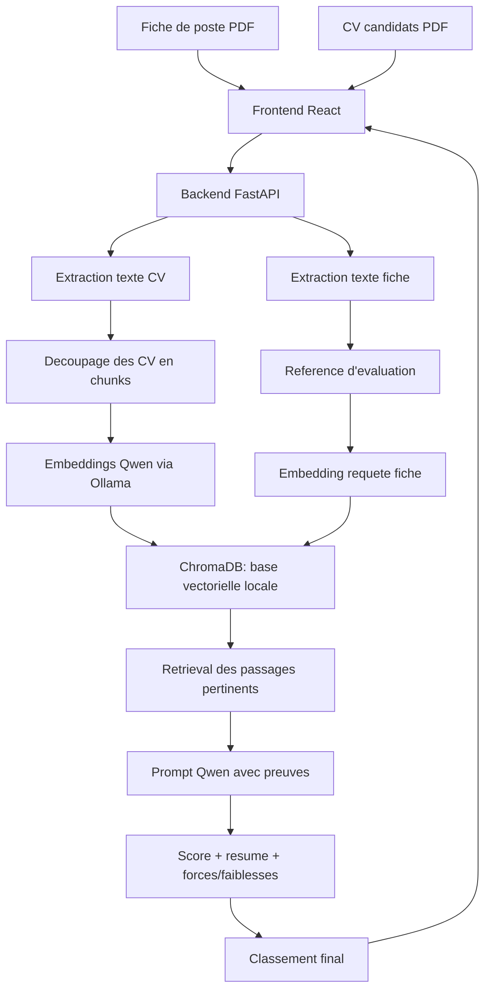

# Resume Ranking RAG

Application PFE de classement de CV par rapport a une fiche de poste. L'utilisateur importe une fiche de poste et des CV, le backend extrait le texte, decoupe les CV en chunks, calcule des embeddings Qwen avec Ollama, indexe les vecteurs dans ChromaDB, recupere les passages pertinents, puis un LLM Qwen produit le classement final.

## Fonctionnalites

- Interface React pour importer une fiche de poste PDF et un ou plusieurs CV PDF.
- API FastAPI avec endpoint principal `POST /api/analyze/documents`.
- Extraction de texte via PyMuPDF pour les PDF. Le backend supporte aussi DOCX/TXT/MD pour les tests et usages API.
- Decoupage des CV en chunks, embeddings Ollama/Qwen et recherche semantique dans ChromaDB.
- Classement LLM avec score, resume, points forts, points faibles, detail par critere et preuves RAG.
- Cache local des embeddings dans `data/cache/` pour eviter de recalculer les memes vecteurs.
- Aucune limite applicative fixe sur le nombre de CV uploades. Les limites pratiques viennent du temps de traitement, de la taille des fichiers, de la RAM et des performances de la machine Ollama.
- Script optionnel de generation de CV PDF anonymises pour les tests.

## Architecture



La fiche de poste sert de reference d'evaluation. Les CV uploades deviennent la base documentaire temporaire de l'analyse : ils sont decoupes, vectorises et indexes dans ChromaDB pour le run courant.

## Modeles Ollama

Valeurs par defaut dans `backend/app/config.py` :

- LLM : `qwen2.5:7b`
- Embeddings : `qwen3-embedding:0.6b`
- Serveur Ollama : `http://localhost:11434`
- Base vectorielle : `data/chroma`

Commandes de preparation :

Si la commande `ollama` n'est pas reconnue, installer Ollama pour Windows puis rouvrir le terminal.

```powershell
ollama pull qwen3-embedding:0.6b
ollama pull qwen2.5:7b
```

Sur une machine plus limitee, le modele de generation peut etre remplace par :

```powershell
ollama pull qwen2.5:3b
```

Puis mettre `OLLAMA_GENERATION_MODEL=qwen2.5:3b` dans `.env`.

## Structure utile

```text
backend/
  app/
    main.py              # endpoints FastAPI
    config.py            # configuration et variables d'environnement
    schemas.py           # schemas de reponse
    models.py            # modeles internes
    services/
      parser.py          # extraction PDF/DOCX/TXT/MD
      criteria.py        # construction de la fiche de criteres
      chunker.py         # decoupage des textes
      ollama_client.py   # embeddings + generation Ollama/Qwen + cache
      vector_store.py    # ChromaDB
      ranking.py         # orchestration RAG + scoring
      rag_engine.py      # conversion des resultats API
  tests/
frontend/
  src/
    App.tsx
    api.ts
    components/
      DocumentAnalyzer.tsx
      RankingTable.tsx
data/
  criteria/spm_data_analyst_packaging.json
  uploads/               # genere localement, ignore par Git
  chroma/                # genere localement, ignore par Git
  cache/                 # genere localement, ignore par Git
tools/
  generate_test_cv_pdfs.py
```

## Configuration locale

Creer un fichier `.env` a la racine du projet. Il est ignore par Git.

```env
LLM_PROVIDER=ollama
OLLAMA_BASE_URL=http://localhost:11434
OLLAMA_GENERATION_MODEL=qwen2.5:7b
OLLAMA_EMBEDDING_MODEL=qwen3-embedding:0.6b
CHROMA_PATH=data/chroma
VITE_API_URL=http://127.0.0.1:8001
```

## Lancer Ollama

Verifier que le service Ollama est actif :

```powershell
ollama list
```

Tester le modele LLM :

```powershell
ollama run qwen2.5:7b
```

Tester les embeddings via l'API locale :

```powershell
Invoke-RestMethod `
  -Uri http://localhost:11434/api/embed `
  -Method Post `
  -ContentType "application/json" `
  -Body '{"model":"qwen3-embedding:0.6b","input":"Developpeur Python avec experience FastAPI"}'
```

## Lancer le backend

```powershell
cd "C:\Users\pc\Documents\travail demander pour mon stage\backend"
python -m venv .venv
.\.venv\Scripts\Activate.ps1
pip install -r requirements-dev.txt
uvicorn app.main:app --host 127.0.0.1 --port 8001 --reload
```

API : [http://127.0.0.1:8001](http://127.0.0.1:8001)  
Swagger : [http://127.0.0.1:8001/docs](http://127.0.0.1:8001/docs)

## Lancer le frontend

```powershell
cd "C:\Users\pc\Documents\travail demander pour mon stage\frontend"
pnpm install
$env:VITE_API_URL="http://127.0.0.1:8001"
pnpm run dev
```

Interface : [http://127.0.0.1:5173](http://127.0.0.1:5173)

## Flux utilisateur

1. Importer une fiche de poste PDF.
2. Importer un ou plusieurs CV PDF.
3. Cliquer sur `Analyser et classer`.
4. Lire le classement : score, resume, points forts, points faibles, detail des criteres et preuves.

## Endpoints

- `GET /` : statut simple de l'API.
- `GET /api/health` : controle de sante.
- `GET /api/criteria/default` : fiche de criteres JSON par defaut.
- `POST /api/analyze/documents` : analyse une fiche de poste et des CV uploades.

## Generer des CV PDF de test

Le script `tools/generate_test_cv_pdfs.py` est un outil local de test. Il lit `archive.zip`, anonymise des lignes du dataset et genere 20 PDF dans `output/pdf/test_cvs/`. Ces PDF ne sont pas versionnes.

Installer la dependance du script si elle n'est pas deja presente :

```powershell
python -m pip install reportlab
```

Generer les PDF :

```powershell
cd "C:\Users\pc\Documents\travail demander pour mon stage"
python tools/generate_test_cv_pdfs.py "C:\Users\pc\Desktop\archive.zip"
```

Ces fichiers servent de CV de test a uploader manuellement dans l'interface.

## Tests

Backend :

```powershell
cd "C:\Users\pc\Documents\travail demander pour mon stage\backend"
pytest
python -m compileall app
```

Frontend :

```powershell
cd "C:\Users\pc\Documents\travail demander pour mon stage\frontend"
pnpm run build
```

Les tests activent `RAG_TEST_MODE=1` dans `backend/tests/conftest.py`. Ce mode conserve le meme parcours applicatif et utilise des embeddings deterministes pour ne pas dependre d'un serveur Ollama lance pendant `pytest`.
