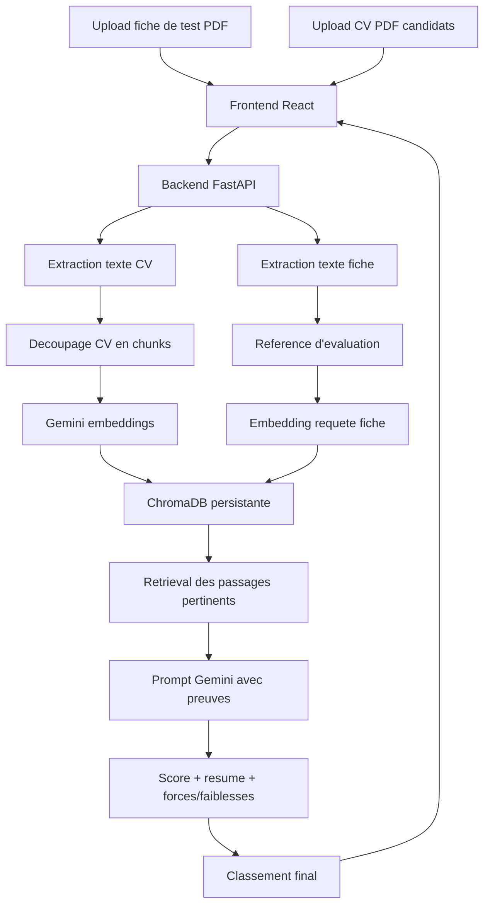

# Architecture du projet

## Objectif

Classer plusieurs CV par rapport a une fiche de test importee, en produisant un score defendable et des preuves textuelles. La fiche contient les criteres du poste, les exigences, le profil recherche et les competences demandees.

## Flux principal

## Choix techniques

- FastAPI : API claire, Swagger automatique, support upload multi-fichiers.
- PyMuPDF + python-docx : extraction PDF/DOCX/TXT/MD.
- Gemini embeddings : `text-embedding-004`, avec repli `gemini-embedding-001`.
- ChromaDB : stockage vectoriel persistant des chunks.
- Gemini generation : `gemini-flash-lite-latest`, avec repli `gemini-flash-latest`.
- SQLite : stockage des CV importes et des analyses.
- React + TypeScript : interface stable et typage des reponses.

## Entrees principales

- Fiche de test : document de reference d'evaluation.
- CV candidats : documents a analyser et classer.
- Archive Kaggle : source de base CV importable via `backend/scripts/import_kaggle_archive.py`.
- Base importee : analysable via `POST /api/analyze/database` avec une fiche de poste.

## Important

Le systeme n'utilise plus TF-IDF pour le RAG applicatif. TF-IDF a ete remplace par ChromaDB + embeddings Gemini. Le mode de test automatise utilise uniquement des embeddings deterministes pour eviter la consommation API pendant `pytest`.
