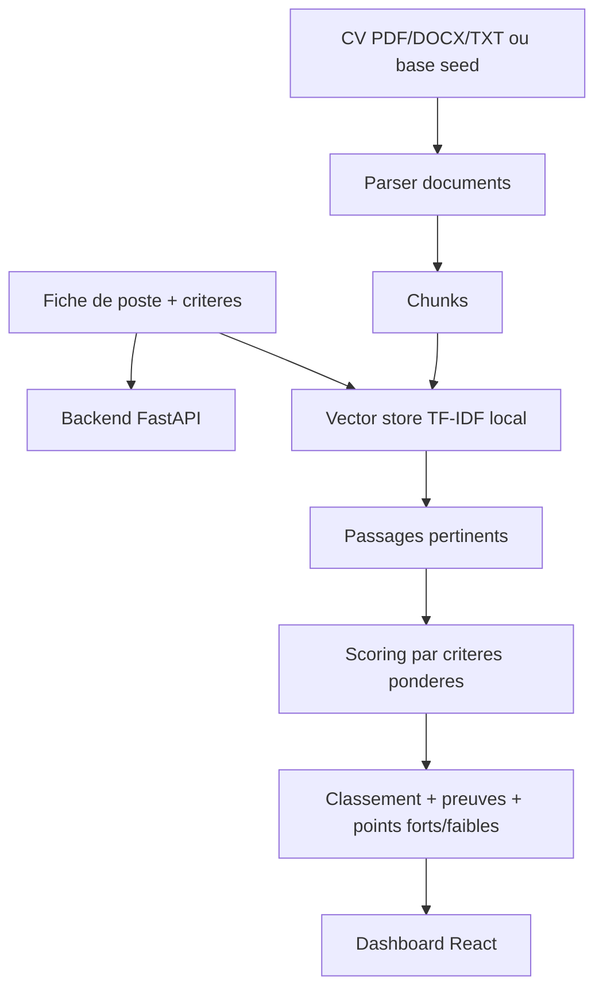

# Architecture du projet

## Objectif

Classer plusieurs CV par rapport a une fiche de poste, en produisant un score defendable et des preuves textuelles. Le projet suit l'esprit RAG du cahier fourni : extraction, decoupage, vectorisation, recuperation, analyse et classement.

## Flux principal

## Choix techniques

- FastAPI : API claire, Swagger automatique, support upload multi-fichiers.
- SQLite : stockage simple de la base provisoire et des analyses.
- React + TypeScript : interface stable et typage des reponses.
- TF-IDF local : vectorisation deterministe pour eviter les echecs lies aux cles API ou telechargements de modeles.
- Structure modulaire : parser, chunker, vector store, criteria, ranking.

## Remplacement futur

Le module `TfidfVectorStore` peut etre remplace par ChromaDB + Sentence Transformers sans modifier le frontend. Les sorties attendues restent :

- `match_score`
- `summary`
- `pros`
- `cons`
- `criteria_breakdown`
- `evidence`

