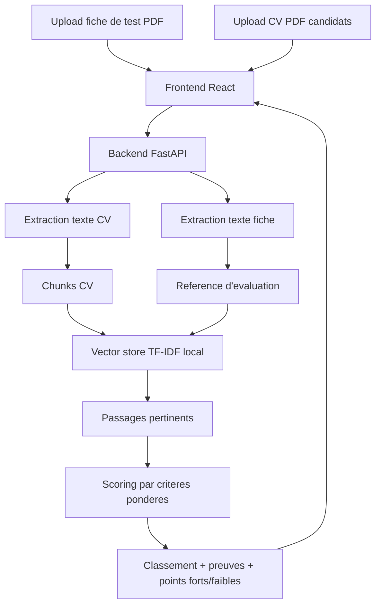

# Architecture du projet

## Objectif

Classer plusieurs CV par rapport a une fiche de test importee, en produisant un score defendable et des preuves textuelles. La fiche contient les criteres du poste, les exigences, le profil recherche et les competences demandees.

## Flux principal

## Choix techniques

- FastAPI : API claire, Swagger automatique, support upload multi-fichiers.
- SQLite : stockage simple de la base provisoire et des analyses.
- React + TypeScript : interface stable et typage des reponses.
- TF-IDF local : vectorisation deterministe pour eviter les echecs lies aux cles API ou telechargements de modeles.
- Structure modulaire : parser, chunker, vector store, criteria, ranking.

## Entrees principales

- Fiche de test : document de reference d'evaluation.
- CV candidats : documents a analyser et classer.

La base provisoire reste un mode de test. La version simple fonctionne sans base permanente : chaque analyse recoit une fiche et plusieurs CV.

## Remplacement futur

Le module `TfidfVectorStore` peut etre remplace par ChromaDB + Sentence Transformers sans modifier le frontend. Les sorties attendues restent :

- `match_score`
- `summary`
- `pros`
- `cons`
- `criteria_breakdown`
- `evidence`
