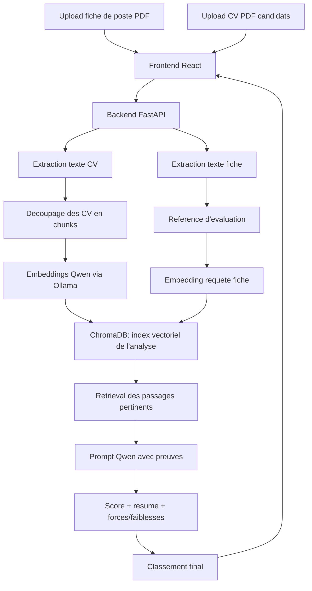

# Architecture du projet

## Objectif

Classer plusieurs CV uploades manuellement par rapport a une fiche de poste importee, en produisant un score defendable et des preuves textuelles. La fiche contient les criteres du poste, les exigences, le profil recherche et les competences demandees.

## Flux principal

## Choix techniques

- FastAPI : API claire, Swagger automatique, support upload multi-fichiers.
- PyMuPDF : extraction du texte des PDF.
- Ollama embeddings : `qwen3-embedding:0.6b`.
- ChromaDB : base vectorielle des chunks de CV uploades.
- Ollama generation : `qwen2.5:7b`.
- React + TypeScript : interface stable et typage des reponses.

## Role des donnees

- Fiche de poste : reference d'evaluation, pas une base de donnees.
- CV candidats : documents a analyser et a classer.
- ChromaDB : base vectorielle construite a partir des CV uploades pendant l'analyse.

Il n'y a pas de base SQLite dans l'architecture applicative. Les CV ne sont pas precharges dans une base classique : l'utilisateur les depose, puis le systeme les transforme en vecteurs et les exploite via ChromaDB.

## Important

Le systeme n'utilise pas TF-IDF pour le RAG applicatif. Le retrieval passe par ChromaDB + embeddings Qwen via Ollama. Le mode de test automatise utilise uniquement des embeddings deterministes pour ne pas dependre d'un serveur Ollama lance pendant `pytest`.
